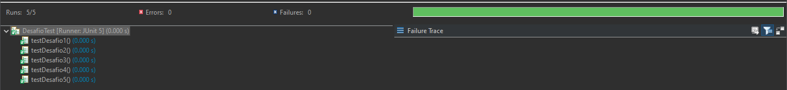

# Desafios Target Systems

Este repositório contém uma série de desafios de programação, juntamente com suas respectivas soluções e testes. Os desafios cobrem uma variedade de tópicos, incluindo cálculos matemáticos, manipulação de strings, processamento de JSON e análise de dados.

## Desafios

### Desafio 1
Calcula a soma dos números inteiros de 1 até um índice especificado.

### Desafio 2
Verifica se um número pertence à sequência de Fibonacci.

### Desafio 3
Analisa um arquivo JSON contendo valores de faturamento diário e calcula:
- O menor e o maior valor de faturamento.
- A média mensal de faturamento.
- O número de dias com faturamento acima da média.

### Desafio 4
Calcula o percentual de representação de faturamento de diferentes estados e outras categorias.

### Desafio 5
Inverte uma string fornecida pelo usuário.

## Execução do Código

Para executar os códigos, você pode compilar e rodar as classes diretamente no terminal ou usar uma IDE como IntelliJ IDEA ou Eclipse. Certifique-se de que o JDK está instalado e configurado em seu ambiente.

1. **Compilação**: Navegue até o diretório do projeto e compile o código usando:
    ```bash
    mvn compile
    ```

2. **Execução**: Para executar uma classe específica, use:
    ```bash
    mvn exec:java -Dexec.mainClass="testeTargetSystems.Desafio1"
    ```

## Execução dos Testes

Os testes são realizados usando JUnit 5 e Maven. Para executar os testes, siga estas etapas:

1. **Com Maven**:
    - Navegue até o diretório do projeto e execute:
      ```bash
      mvn test
      ```

2. **Usando uma IDE**:
    - Abra o projeto em uma IDE que suporte JUnit 5 (por exemplo, IntelliJ IDEA ou Eclipse).
    - Execute os testes a partir da IDE.

## Resultados dos Testes

Aqui estão os resultados dos testes executados:

### Testes dos Desafios


*Adicione imagens dos resultados dos testes na pasta `imagens` e atualize o README com as capturas de tela relevantes.*

## Estrutura do Projeto

- `src/testeTargetSystems/`: Contém as soluções para os desafios.
- `src/testeTargetSystemsTest/`: Contém os testes correspondentes para as soluções.
- `src/main/resources/`: Contém arquivos de recursos, como `dados.json`, usados pelos desafios.

## Requisitos

- JDK 11 ou superior.
- Maven para execução dos testes.
- JUnit 5 para execução de testes.

## Licença

Este projeto está licenciado sob a [Licença MIT](LICENSE).

## Contato

Se você tiver alguma dúvida ou sugestão, sinta-se à vontade para abrir uma issue neste repositório.
